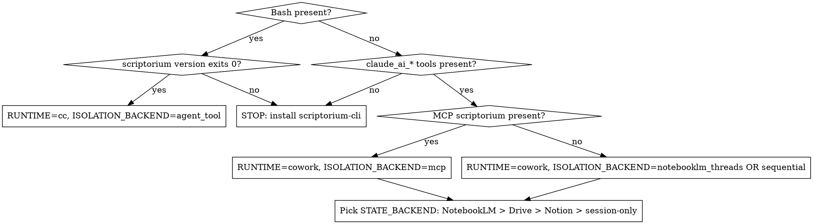
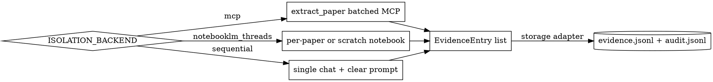

# Scriptorium v0.4 — Superpowers-style Discipline Enforcement (Layers A + B)

**Status:** COMPLETE — all 4 sections approved. Ready for spec self-review and user review before invoking `superpowers:writing-plans`.
**Brainstorm dates:** 2026-04-23 (Sections 1–2), 2026-04-24 (Sections 3–4)
**Spec author:** Claude (with Jeremiah, in `superpowers:brainstorming` flow)

---

## What we're building (one paragraph)

A v0.4 release of Scriptorium that adopts Superpowers' enforcement-theater patterns *while preserving Scriptorium's superior structural foundations* (schema validation, dual-runtime portability, append-only audit). Two layers ship together as one coherent release: Layer A (Discipline Enforcement) and Layer B (Subagent Architecture). Cross-cutting carriers: a new `scriptorium-mcp` MCP server (Cowork-side bridge) and a new `phase-state.json` artifact (state-adapter-portable phase manifest).

---

## Decisions locked (Q1–Q7)

| Q | Decision | Rationale |
|---|---|---|
| Q1 — scope | **(c)** One spec covering A+B; defer operational-robustness items (rollback, evidence editor) to a follow-on milestone | A+B are the architecturally significant work; C+D are nice-to-haves that don't shape architecture |
| Q2 — Cowork compat | **(a) + ultrathink:** CC-first structurally, but treat Cowork parity as first-class design constraint, not follow-on | "Most users will use Cowork for this" |
| Q3 — Cowork injection mechanism | **(a)** Ship a thin `scriptorium-mcp` server; its `instructions` field IS Cowork's SessionStart parity | Cleanest Cowork-native equivalent; positions Scriptorium as a real Cowork-citizen plugin |
| Q4 — verifications timing | **(a)** Run V1-V3 spikes before plan-writing | MCP injection question shapes whether A1 is viable for Cowork |
| Q5 — Cowork extraction isolation | **(d)** All three approaches, picked by runtime probe (scriptorium-mcp present → MCP tool batch; NotebookLM present → per-paper chat threads; neither → sequential with context-clearing prompts) | Extends state-adapter pattern from "where state lives" to "where isolation comes from" |
| Q6 — tone register | **(c)** Mixed: Superpowers-direct ALL-CAPS HARD-GATE for the three disciplines; academic-methodological register everywhere else | Visual marker for "this is the line you don't cross" |
| Q7 — reviewer gate blocking | **(b)** Soft-block by default with audited override (`audit.jsonl` records `reviewer.override` action) | Hard-blocking enforces discipline; override exists because LLM reviewers misfire |

---

## Verification spike findings (V1–V3)

**V1 — Does the Anthropic MCP host auto-inject `instructions` into every claude.ai session?**
- **Result:** PARTIAL. MCP spec doesn't guarantee per-session re-injection (vs. only first-connect). Size budget (~3-4KB for our 80-line INJECTION.md) is safe.
- **Implication:** A1 needs a verification spike (V1.5) before plan execution + a skill-router fallback path.
- **Sources:** modelcontextprotocol.io specification 2025-03-26; Claude Code subagent docs; Anthropic Connectors FAQ.

**V2 — Does Cowork support true parallel subagent dispatch (Claude Code Task/Agent equivalent)?**
- **Result:** NO. Cowork has no native Task/Agent tool. Closest primitive: parallel MCP tool calls within one skill step.
- **Implication:** B1 stays for CC. B2 is honestly degraded — must drop the parity claim and document the gap in the runtime capability table.
- **Sources:** Anthropic Connectors setup guide; Claude Code subagent docs.

**V3 — Does NotebookLM support the lit-reviewer pattern (upload synthesis as source, query against existing corpus, return citations)?**
- **Result:** CONFIRMED and stronger than expected.
  - `mcp__notebooklm-mcp__source_add` accepts markdown via `source_type=text` or `source_type=file` (file_path with .md extension).
  - `mcp__notebooklm-mcp__notebook_query` supports `source_ids` parameter to filter which sources to query.
  - Returns native NotebookLM citations: `sources_used` (list of source IDs), `references` (list of `{source_id, citation_number, cited_text}` dicts).
- **Implication:** B5 (Cowork reviewer) is *more* powerful than the CC version — get attribution for free, machine-parseable.
- **Source files:** `notebooklm_tools/core/sources.py` (lines 403-455 for text source, 659-730 for file source); `notebooklm_tools/core/conversation.py` (line 127 for source_ids param, lines 234-236 for citations in response).

**V1.5 spike** (carries into implementation plan as task #1, ≤30 min): Connect a stub `scriptorium-mcp` to a fresh claude.ai session, send 3 messages, verify the discipline content appears in each session's system context. Outcome shapes whether `scriptorium-mcp` carries the injection alone or whether the skill-router fallback is also required.

---

# Section 1 — Shape and Principles (APPROVED)

## Single source of truth: `INJECTION.md`

A new file `skills/using-scriptorium/INJECTION.md` (≤80 lines) holds the discipline content that needs to land in every session. Both injection paths (CC `SessionStart` hook, Cowork `scriptorium-mcp` `instructions` field) read this same file. **No duplication of discipline content.** Edits to the disciplines happen in one place.

Contents: three disciplines (verbatim), Red Flags table for the most common rationalizations, pointer to `using-scriptorium` for the runtime probe.

## Nine guiding principles (each with a measurable success criterion)

| # | Principle | Success criterion |
|---|---|---|
| 1 | **Two equally mechanical enforcement paths, one prose layer.** CC and Cowork lean on native primitives; skill prose is identical. | A "parity-check" lint script flags any skill prose that only describes one runtime's path. Zero violations at v0.4 ship. |
| 2 | **State-adapter pattern extends to enforcement.** What the adapter did for storage now also covers isolation and verification. | All three new behaviors (injection, isolation, verification) implemented through the existing adapter abstraction; no skill hardcodes a runtime branch outside `using-scriptorium`'s probe. |
| 3 | **Mixed register.** Three disciplines = Superpowers-direct ALL-CAPS HARD-GATE. Everything else = academic-methodological. | Reviewer audit of every modified skill: HARD-GATE blocks appear only on the three disciplines; non-discipline prose uses no ALL-CAPS imperatives. |
| 4 | **Honest about degradation.** A degraded Cowork path is acceptable iff: (a) it produces audit-equivalent output, (b) the gap is named in `using-scriptorium`'s runtime capability table, (c) there's a documented path to closing the gap. | Every degraded behavior in shipped v0.4 is named, documented, and has an issue tracking the closure path. |
| 5 | **Soft-block by default with audited override.** Reviewer gates block synthesis from being marked complete; explicit user override is logged to `audit.jsonl`. | Reviewer-fail without override: phase-state.synthesis stays `failed`. Override: phase-state.synthesis = `overridden`, audit.jsonl entry includes `{action: "reviewer.override", reviewer, reason}`. |
| 6 | **Cite grammar inviolable.** Every reviewer, every override, every audit entry preserves `[paper_id:locator]`. No `[1]`/`[2]` inline numbering anywhere downstream. | Reviewer outputs schema-validated to ensure all `paper_id` references resolve in `corpus.jsonl`; format violations rejected at write-time. |
| 7 | **Backwards compatible by default; opt-in to enforcement.** v0.3.1 in-flight reviews continue working without phase-manifest. v0.4 enforcement gated behind `config.toml: enforce_v04 = true`. | Smoke test: a v0.3.1 review directory loads in v0.4 CLI without errors. With `enforce_v04 = false`, no new HARD-GATEs fire. |
| 8 | **Single source of truth for shared content.** Discipline text, schema definitions, and runtime probe behavior each have exactly one canonical file. | Grep audit: no duplicate copy of the three-disciplines paragraph in skills/, hooks/, or scriptorium-mcp/. |
| 9 | **`scriptorium-mcp` is the Cowork bridge.** Whenever Cowork lacks a CC primitive (SessionStart, lock files, agent dispatch), the MCP server provides the equivalent. | Every CC primitive used by Layer A or B has a documented MCP-server equivalent or an explicit "honest gap" entry per principle 4. |

## Shape diagram

```
┌──────────────────────────────────────────────────────────────────────┐
│  INJECTION (loaded once per session)                                 │
│  ┌──────────────────────┐    ┌────────────────────────────────────┐ │
│  │ CC: SessionStart hook │   │ Cowork: scriptorium-mcp server     │ │
│  │ reads INJECTION.md    │   │ publishes INJECTION.md as          │ │
│  │ → emits as            │   │ MCP `instructions` field           │ │
│  │ additionalContext     │   │ → host injects on session connect  │ │
│  └──────────┬────────────┘   └─────────────┬──────────────────────┘ │
│             └─────────────┬─────────────────┘                       │
│                           ▼                                          │
│         Three disciplines + Red Flags + probe pointer                │
│         become part of the system context for the session            │
└──────────────────────────────────────────────────────────────────────┘
                            │
                            ▼
┌──────────────────────────────────────────────────────────────────────┐
│  ENFORCEMENT (active throughout the review lifecycle)                │
│                                                                       │
│  using-scriptorium ──[probe]──> sets RUNTIME, STATE_BACKEND,         │
│                                  ISOLATION_BACKEND                    │
│         │                                                             │
│         ▼                                                             │
│  phase-state.json (state-adapter artifact)                            │
│         ▲     ▲                                                       │
│         │     │  read  ┌──────────────────────────┐                  │
│         │     └────────┤ HARD-GATE checks before  │                  │
│         │              │ each phase transition    │                  │
│         │              └──────────────────────────┘                  │
│         │                                                             │
│         │     write                                                   │
│         └────────┬─────────────────────────────────────┐             │
│                  │                                      │             │
│  ┌───────────────┴────────────┐    ┌──────────────────┴───────────┐ │
│  │ verification-before-       │    │ Phase skills (lit-extract,   │ │
│  │   completion-scriptorium   │    │   lit-synthesize, etc.)      │ │
│  │ "no phase-complete claim   │    │   write status transitions   │ │
│  │   without verify output"   │    │                              │ │
│  └────────────────────────────┘    └──────────────────────────────┘ │
└──────────────────────────────────────────────────────────────────────┘
                            │
                            ▼  (specifically: AT lit-synthesizing exit)
┌──────────────────────────────────────────────────────────────────────┐
│  REVIEWER GATE (Layer B — fires between synthesis and publishing)    │
│                                                                       │
│  ┌──────────────────────┐         ┌─────────────────────────────┐   │
│  │ CC path:             │         │ Cowork path:                 │   │
│  │ Agent tool dispatches│         │ source_add(synthesis.md)     │   │
│  │   lit-cite-reviewer  │         │ + 2× notebook_query()        │   │
│  │   lit-contradiction- │         │   (cite-cov, contradiction)  │   │
│  │     reviewer         │         │ Returns native citations     │   │
│  └──────────┬───────────┘         └────────────┬─────────────────┘   │
│             └────────────┬─────────────────────┘                     │
│                          ▼                                            │
│         Both produce identical reviewer-output JSON                  │
│         → appended to audit.jsonl                                    │
│         → updates phase-state.synthesis                              │
│                          │                                            │
│            ┌─────────────┴─────────────┐                             │
│            ▼                           ▼                             │
│   pass: → "complete"          fail: → "failed"                       │
│   (publishing unblocks)       │                                       │
│                               ▼                                       │
│                      User invokes override?                          │
│                       ┌───────┴───────┐                              │
│                       no              yes                             │
│                       │               │                              │
│                       ▼               ▼                              │
│             stay "failed"     → "overridden"                         │
│             (publishing      audit.jsonl gets                        │
│              blocked)         {action: "reviewer.override",          │
│                                reviewer, reason, ts}                 │
└──────────────────────────────────────────────────────────────────────┘
```

## `phase-state.json` state machine

```
        ┌─────────┐
        │ pending │
        └────┬────┘
             │ phase skill fires
             ▼
        ┌─────────┐
        │ running │
        └────┬────┘
             │ phase skill exits
             ▼
       ┌──────────────┐
       │ verify check │
       └──────┬───────┘
              │
       ┌──────┴───────┐
       ▼              ▼
   ┌────────┐    ┌────────┐
   │complete│    │ failed │
   └────────┘    └────┬───┘
                      │
              user override?
              ┌───────┴────────┐
              no               yes
              │                 │
              ▼                 ▼
         stay failed      ┌────────────┐
         (downstream      │ overridden │
          phases blocked) └────────────┘
                          (downstream phases unblocked,
                           override row in audit.jsonl)
```

Schema: `{ phase: str, status: "pending"|"running"|"complete"|"failed"|"overridden", artifact_path: str, verified_at: ISO8601, verifier_signature: sha256(artifact), override?: {reason: str, ts: ISO8601} }`

## Layer A → Layer B interface contract

Layer A produces; Layer B consumes:
- `phase-state.json` with `phase: "synthesis", status: "running"` (synthesis is in progress; reviewers may not yet fire)
- On `lit-synthesizing` exit: cite-check passes locally → A writes `phase: "synthesis", status: "running"` and triggers Layer B
- Layer B writes the transition to `complete` / `failed` / `overridden`
- `audit.jsonl` is the shared bus: A writes phase transitions, B writes reviewer outputs and overrides

No *phase* skill in A directly invokes a *phase* skill in B. The contract is the artifacts. (Reviewer *agents* — see B4 / B5 — are dispatched from inside `lit-synthesizing`'s exit sequence; that is intra-skill, not skill-to-skill.)

## What this is NOT

- Not a rewrite of phase logic (search, screen, extract internals stay)
- Not a new search backend or new state backend
- Not a UI/frontend change
- Not a tone change for non-discipline prose (academic register preserved everywhere except HARD-GATE blocks)
- Not a new CLI command surface beyond what Layer A and B require (`scriptorium verify --synthesis`, `scriptorium phase show`, `scriptorium phase override`)
- Not the operational-robustness items (rollback, evidence editor) — deferred to a follow-on milestone
- Not a v0.3 → v0.4 hard cutover (legacy reviews continue working unchanged)

## Open spike (V1.5)

Verify whether MCP `instructions` field is auto-injected on every claude.ai session (vs. only first-connect). Outcome shapes whether `scriptorium-mcp` carries the injection alone or whether the skill-router fallback (every skill opens with "If using-scriptorium hasn't fired this session, fire it now") is also required.

**Acceptance:** Connect a stub `scriptorium-mcp` to a fresh claude.ai session, send 3 messages, verify the discipline content appears in each session's system context.

This is **task #1** in the implementation plan; ≤30 min; unblocks Layer A's injection design.

## Shipping cadence

A and B ship together as v0.4. Build order *within* the spec sequences A's foundation (manifest + injection) before B's reviewers (which depend on phase-state.json being writable). Detailed sequence appears in Section 4.

---

# Section 2 — Layer A: Discipline Enforcement (APPROVED)

## A1. Dual-runtime injection

### CC hook (`hooks/session-start.sh`)

```bash
#!/usr/bin/env bash
set -euo pipefail

: "${CLAUDE_PLUGIN_ROOT:?session-start hook requires CLAUDE_PLUGIN_ROOT}"
INJECTION="${CLAUDE_PLUGIN_ROOT}/skills/using-scriptorium/INJECTION.md"

if [ ! -s "$INJECTION" ]; then
  echo "scriptorium: INJECTION.md missing or empty at $INJECTION — discipline not injected" >&2
  exit 0   # don't block session, but stderr-warn
fi

# Use jq if available (cleaner), fall back to python3, fall back to inline awk
if command -v jq >/dev/null 2>&1; then
  ESCAPED=$(jq -Rs . < "$INJECTION")
elif command -v python3 >/dev/null 2>&1; then
  ESCAPED=$(python3 -c 'import json,sys; print(json.dumps(sys.stdin.read()))' < "$INJECTION")
else
  echo "scriptorium: neither jq nor python3 available — cannot escape INJECTION.md" >&2
  exit 0
fi

cat <<EOF
{"hookSpecificOutput": {"hookEventName": "SessionStart", "additionalContext": ${ESCAPED}}}
EOF
```

`hooks/hooks.json` gains a `SessionStart` entry alongside the existing `PostToolUse`.

### Cowork — MCP server location and skeleton

**Location:** subpackage `scriptorium/mcp/`. Single `pipx install scriptorium-cli` ships both CLI and MCP server. User runs `scriptorium-mcp` binary OR `python -m scriptorium.mcp`.

**Server (`scriptorium/mcp/server.py`):**

```python
from mcp.server.fastmcp import FastMCP
from pathlib import Path
from scriptorium import storage, verify as verify_mod

INJECTION = (Path(__file__).resolve().parent.parent.parent
             / "skills/using-scriptorium/INJECTION.md").read_text()

mcp = FastMCP(name="scriptorium", instructions=INJECTION)

@mcp.tool()
async def verify(phase: str, review_dir: str) -> dict:
    """Run scriptorium verify for a phase. Returns {ok, signature, errors[]}."""
    return verify_mod.run(phase=phase, review_dir=review_dir).to_dict()

@mcp.tool()
async def phase_show(review_dir: str, phase: str | None = None) -> dict:
    """Read phase-state for a review. Returns {phases: {...}} or {phase: {...}}."""
    return storage.phase_state.read(review_dir, phase)

@mcp.tool()
async def phase_set(review_dir: str, phase: str, status: str) -> dict:
    """Write a phase status transition. Returns updated phase entry."""
    return storage.phase_state.set(review_dir, phase, status)

@mcp.tool()
async def phase_override(review_dir: str, phase: str, reason: str) -> dict:
    """Mark a failed phase as overridden; appends audit entry.

    Authority guard: Cowork callers must include the literal marker
    'OVERRIDE SYNTHESIS:' (or matching phase) in the user-message that
    triggers this call. Orchestrator-claude cannot self-authorize.
    """
    return storage.phase_state.override(review_dir, phase, reason)

@mcp.tool()
async def extract_paper(
    review_dir: str,
    paper_id: str,
    pdf_source: str,
    extraction_template: str,
    inclusion_criteria: str,
) -> dict:
    """Extract evidence from one paper. Stateless. Returns {paper_id, evidence: [...], audit: [...]}.

    pdf_source modes:
      - 'file:///abs/path.pdf'  (Mode 1, preferred — local stdio MCP)
      - 'drive://folder/file'   (Mode 2 — remote MCP, signed Drive URI)
      - 'text://...'            (Mode 3 — inline text, short papers only)
    """
    from scriptorium import extract as extract_mod
    return extract_mod.run(
        review_dir=review_dir,
        paper_id=paper_id,
        pdf_source=pdf_source,
        extraction_template=extraction_template,
        inclusion_criteria=inclusion_criteria,
    ).to_dict()

@mcp.tool()
async def validate_reviewer_output(reviewer_json: dict) -> dict:
    """Schema-validate a reviewer-output JSON. Returns {ok: bool, errors: [...]}.

    Invalid reviewer outputs are rejected at write time, never silently appended to audit.jsonl.
    """
    from scriptorium import reviewers as rev_mod
    return rev_mod.validate(reviewer_json).to_dict()

if __name__ == "__main__":
    mcp.run(transport="stdio")
```

### `INJECTION.md` (drafted, ~70 lines, ~3.2KB)

```markdown
# Scriptorium discipline (auto-injected; read first)

You are working with Scriptorium, a literature-review plugin. Three disciplines
are non-negotiable in every session that touches a literature corpus, evidence
store, or synthesis.

## The three disciplines

1. **Evidence-first claims.** Every sentence in `synthesis.md` either cites
   `[paper_id:locator]` that exists in the evidence store, or it is stripped.
   No rhetorical-but-uncited writing.

2. **PRISMA audit trail.** Every search, screen, extraction, and reasoning
   decision appends one entry to the audit trail. Entries never overwrite;
   the trail is reconstructable end-to-end.

3. **Contradiction surfacing.** When evidence on the same concept points in
   different directions, name the disagreement explicitly with citations on
   each side. Do not average conflict into a bland consensus sentence.

## Top-5 Red Flags

| Thought | Reality |
|---|---|
| "I'll paraphrase this finding without a locator" | Paraphrase without `[paper_id:locator]` is an unsupported claim. Cite-check will fail. |
| "I'll just visually scan for missing cites" | That's how unsupported claims ship into dissertations. Run the verifier. |
| "I can skip the runtime probe, I know what runtime I'm in" | Connectors and state backends change between sessions. Probe anyway. |
| "These two papers basically say the same thing" | If they used different methods or populations, name the difference. Don't average. |
| "I'll backfill the audit entry later" | Backfilled audit entries are dishonest. Append at the moment of decision. |

## Before any literature-review action

Fire the `using-scriptorium` skill to run the runtime probe. The probe sets
RUNTIME, STATE_BACKEND, and ISOLATION_BACKEND for the session. There is no
acceptable shortcut — every other Scriptorium skill depends on these being set.
```

### Skill-router fallback (only fires if V1.5 spike returns negative)

Every skill's frontmatter description gains a triggers preamble. Example for `lit-searching`:

```yaml
---
name: lit-searching
description: Use when the user asks to find, search, or discover papers, articles, citations, references, sources, literature, prior work, or related research. If `using-scriptorium` has not fired this session, fire it first to establish runtime + state backend.
---
```

Skill body opens with: `If you have not seen the canonical injection ("Scriptorium discipline (auto-injected") in this session's system context, fire `using-scriptorium` now before proceeding.`

## A2. `using-scriptorium` rewrite

Three additions to the existing skill:

1. **Adapted 1% rule** (academic register): "Whenever you might touch the literature corpus, the synthesis, the audit trail, or any phase-state, fire `using-scriptorium` first. The probe is cheap; the consequences of a wrong runtime assumption are not."

2. **Expanded Red Flags table** (8 rows; INJECTION.md was top-5 subset). Full rows in approved Section 2.

3. **Dot-graph runtime probe** (corrected from original):



**Session variables set by probe:** `RUNTIME`, `STATE_BACKEND`, `ISOLATION_BACKEND`, `MCP_PRESENT`. (`INJECTION_VERIFIED` removed; replaced with first-message heuristic: "If system context does not contain the string `Scriptorium discipline (auto-injected`, the injection didn't fire — output the three disciplines inline before continuing.")

## A3. HARD-GATE blocks

All HARD-GATEs reference "the phase-state artifact" via the storage adapter, not literal `phase-state.json` paths.

### `lit-synthesizing`

```
<HARD-GATE>
DO NOT WRITE A SENTENCE OF synthesis.md UNTIL THE PHASE-STATE ARTIFACT
SHOWS extraction.status = "complete" OR "overridden".

(In CC: phase-state.json file. In Cowork: the phase-state note/file/page
in the active state backend. Read via the storage adapter — never hardcode
a path.)

Synthesis-before-extract is silent plagiarism risk: cite-check passes
against a partial corpus, masking unsupported claims a full extraction
would have caught.

NO EXCEPTIONS. If extraction is not complete, fire lit-extracting first.
</HARD-GATE>
```

### `running-lit-review`

```
<HARD-GATE>
PHASE ORDERING IS NON-NEGOTIABLE.

Sequence: scope → search → screen → extract → synthesize →
contradiction-check → audit → publishing.

Each phase reads phase-state via the storage adapter before starting.
If the previous phase is not "complete" or "overridden", REFUSE to start
and fire the missing phase first.

There is no shortcut. Out-of-order execution corrupts the audit trail.
</HARD-GATE>
```

### `lit-extracting`

```
<HARD-GATE>
ONLY PAPERS WITH status="kept" IN corpus.jsonl ARE ELIGIBLE FOR
EXTRACTION.

Extracting a paper that hasn't passed screening contaminates the
evidence base and silently violates the inclusion criteria recorded
in scope.json.

Read corpus.jsonl, filter by status="kept", refuse to extract
anything else. If a user asks to extract a dropped paper, require
them to first re-screen it via lit-screening (which will record the
status change in audit.jsonl).
</HARD-GATE>
```

### `lit-publishing` (NEW)

```
<HARD-GATE>
DO NOT INVOKE PUBLISHING (podcast/deck/mindmap/video) UNTIL THE PHASE-STATE
ARTIFACT SHOWS synthesis.status = "complete" OR "overridden", AND
contradiction.status = "complete" OR "overridden".

Publishing an unreviewed synthesis ships unsupported claims into audio,
slides, and infographics — formats where errors are harder to retract.

Read phase-state via the storage adapter. If either gate is not met, refuse
and tell the user which gate is open.
</HARD-GATE>
```

## A4. Red Flags tables (drafted for all four skills)

### `lit-synthesizing`

| Thought | Reality |
|---|---|
| "I'll paraphrase this finding without a locator" | Paraphrase without `[paper_id:locator]` = unsupported claim. Cite-check will fail. |
| "Close enough, the paper is in corpus.jsonl" | Locator required. Page or section, not just paper id. |
| "I'll visually scan for missing cites" | That's how unsupported claims ship into dissertations. Run `scriptorium verify --synthesis`. |
| "This is methodological framing, not a claim" | Framing draws from sources. Cite the framing. |
| "The reviewer will catch it" | Don't outsource your own integrity. Cite-check first; reviewer is the second pass. |
| "I'll fix the cites in a later pass" | No. Cite as you write. Retroactive citation = retroactive fabrication. |

### `lit-extracting`

| Thought | Reality |
|---|---|
| "I'll extract from the abstract — full text isn't loading" | Abstracts are summaries, not evidence. Wait for full text or skip the paper. Don't extract from a summary. |
| "This paper is in corpus.jsonl, that's good enough" | Status must be `kept`. Candidates and dropped papers are NOT eligible. |
| "I'll record the locator as 'see paper'" | Locators must be specific (page, section, paragraph). 'see paper' fails the cite-check. |
| "The quote is paraphrased, that's fine" | Quote field stores the verbatim text. Paraphrase goes in `claim`. Mixing them defeats the audit. |
| "I can skip the audit entry, the evidence row is enough" | Audit entries record the *decision*; evidence rows record the *content*. Both required. |

### `lit-screening`

| Thought | Reality |
|---|---|
| "I'll drop this paper because it looks low-quality" | Inclusion/exclusion criteria live in scope.json. Apply those, not vibes. Record the rule applied in audit. |
| "I'll move directly from `candidate` to `dropped` without recording why" | Every status transition records the rule that triggered it. Silent drops are PRISMA violations. |
| "I'll re-screen all dropped papers because the criteria changed" | Update scope.json first, audit-log the criteria change, then re-screen. Order matters. |
| "I can screen 200 papers in one batch without per-paper audit" | One audit entry per paper per decision. Batching the screen is fine; batching the audit is not. |

### `lit-contradiction-check`

| Thought | Reality |
|---|---|
| "These two papers disagree but it's just methodological — not a real contradiction" | If `direction` differs in evidence.jsonl, it's a contradiction. Name it. Methodological difference is the *explanation*, not the dismissal. |
| "I'll average the effect sizes" | No. Camp A says X, Camp B says Y. Both with citations. Averaging hides the disagreement. |
| "I'll only surface contradictions that are statistically significant" | Significance is one frame. Surface all directional disagreements; let the synthesis decide weight. |
| "Three papers agree, one disagrees — outlier, ignore" | The outlier may be the methodologically strongest paper. Name it. Don't filter. |

## A5. New skill `verification-before-completion-scriptorium`

**File:** `skills/verification-before-completion-scriptorium/SKILL.md` (~35 lines)

```markdown
---
name: verification-before-completion-scriptorium
description: Use after any claim that a phase is complete or that an artifact is valid. Blocks completion claims without fresh verification evidence in the same message. Fires automatically after every phase skill exits.
---

# Verification Before Completion (Scriptorium)

<HARD-GATE>
NO PHASE-COMPLETE CLAIM WITHOUT FRESH VERIFICATION EVIDENCE IN THIS MESSAGE.

Forbidden phrases without accompanying verification output:
- "Synthesis is done."
- "Extraction passed."
- "Audit entry added."
- "Should be complete now."

Required evidence (paste in this message):
- **CC:** `scriptorium verify --<phase>` output (exit code + JSON)
- **Cowork with scriptorium-mcp:** `verify` MCP tool result
- **Cowork without scriptorium-mcp:** `phase-state.json` read result, showing
  status="complete" with verifier_signature matching the artifact's sha256
</HARD-GATE>

## Why

Claiming work complete without verification is dishonesty, not efficiency.
The audit trail records the verification; without it, the audit is silent
on whether the phase actually passed.

## Red flags

| Thought | Reality |
|---|---|
| "I verified it last turn" | Last turn doesn't count. Re-verify in this turn. |
| "It would be slow to re-run" | Slower than catching a silent failure in synthesis? No. |
| "The artifact looks fine" | Looks ≠ verified. Run the command. |
| "I'm sure it works" | Sure isn't a verifier. Run the command. |

## When to fire

- After any phase skill (`lit-extracting`, `lit-synthesizing`, etc.) exits
- After any manual edit to a phase artifact (corpus.jsonl, evidence.jsonl, synthesis.md)
- Before invoking the next phase
- Before declaring the review "ready to publish"
```

**Auto-fire mechanism:**
- **CC:** every phase skill appends to its own `When done` checklist: "Fire `verification-before-completion-scriptorium` before claiming the phase is complete." Prose-level — not a hook (PostToolUse hooks fire on Write/Edit, not on skill exit).
- **Cowork:** same prose convention. Skill's role in both runtimes is to *demand fresh verification evidence in the message*, not to be invoked by a mechanical event.

**A5↔A6 contract:** `verification-before-completion-scriptorium` *reads* phase-state (to confirm `verifier_signature` matches current artifact `sha256`); does NOT write. Writing happens in phase skills via `scriptorium phase set` / `phase_set` MCP tool.

## A6. `phase-state.json` artifact

### Schema

```json
{
  "version": "0.4.0",
  "phases": {
    "scoping":           { "status": "complete",  "artifact_path": "scope.json",        "verified_at": "...", "verifier_signature": "sha256:..." },
    "search":            { "status": "complete",  "artifact_path": "corpus.jsonl",      "verified_at": "...", "verifier_signature": "sha256:..." },
    "screening":         { "status": "complete",  "artifact_path": "corpus.jsonl",      "verified_at": "...", "verifier_signature": "sha256:..." },
    "extraction":        { "status": "complete",  "artifact_path": "evidence.jsonl",    "verified_at": "...", "verifier_signature": "sha256:..." },
    "synthesis":         { "status": "running",   "artifact_path": "synthesis.md",      "verified_at": null,  "verifier_signature": null },
    "contradiction":     { "status": "pending",   "artifact_path": "contradictions.md", "verified_at": null,  "verifier_signature": null },
    "audit":             { "status": "pending",   "artifact_path": "audit.md",          "verified_at": null,  "verifier_signature": null }
  },
  "metadata": {
    "cowork": {
      "reviewer_notebook_id": null
    }
  }
}
```

`verifier_signature` is `sha256(artifact)` at verification time. On re-read, if the artifact's current sha256 differs from `verifier_signature`, the phase auto-reverts to `running` (artifact was edited after verification — verify again).

### State-adapter mapping

| Backend | phase-state location |
|---|---|
| CC filesystem | `phase-state.json` in review root |
| Cowork NotebookLM | note titled `phase-state` (JSON in code block) |
| Cowork Drive | file `phase-state.json` in review folder |
| Cowork Notion | child page `Phase State` with JSON code block |
| Cowork session-only | held in chat memory; warning at probe time that state is non-durable |

### CLI surface (additions)

```
scriptorium phase show [--phase <name>]      # print current phase-state.json
scriptorium phase set <phase> <status>       # write a phase transition
scriptorium phase override <phase> --reason  # mark failed→overridden + audit entry (TTY required)
scriptorium verify --<phase>                 # extended: returns verifier_signature
scriptorium migrate --review-dir <path>      # NEW: backfill phase-state for v0.3 reviews
scriptorium reviewer-validate <file>         # NEW (B6): schema-validate a reviewer-output JSON
```

### MCP tool surface (in scriptorium-mcp)

```python
@server.tool() async def phase_show(phase: str | None = None) -> dict
@server.tool() async def phase_set(phase: str, status: str) -> dict
@server.tool() async def phase_override(phase: str, reason: str) -> dict   # requires user-marker authorization (B7)
@server.tool() async def verify(phase: str) -> dict
@server.tool() async def extract_paper(paper_id: str, pdf_source: str, extraction_template: str, inclusion_criteria: str) -> dict   # NEW (B2.a)
@server.tool() async def validate_reviewer_output(reviewer_json: dict) -> dict   # NEW (B6)
```

Each tool reads/writes via the storage adapter — same Python code path as the CLI.

### Concurrent writes, forward compat, edit consequence, idempotency

- **Concurrent writes:** all phase-state writes (CLI and MCP) acquire `ReviewLock` from `scriptorium/lock.py`. Single-writer; second writer gets `ReviewLockHeld` and surfaces the canonical error. Cowork backends don't get filesystem locks — last-writer-wins with audit-trail reconstruction.
- **Forward compat:** `version` field read on open. If `version > current scriptorium version`, CLI exits with `E_PHASE_STATE_VERSION_NEWER`. MCP returns the same as a tool error.
- **Edit consequence:** if a user edits an artifact after verification, recomputed sha256 won't match `verifier_signature`. Phase auto-reverts to `running`. CLI surfaces: "synthesis.md changed since last verify — phase reverted to `running`. Run `scriptorium verify --synthesis`."
- **Idempotency:** `scriptorium phase set <phase> <same-status>` is a no-op (does not append duplicate audit entry).

## A7. Tone application (Q6 (c) mixed register)

- HARD-GATE blocks: ALL-CAPS, "DO NOT", "NO EXCEPTIONS", "REFUSE" — bounded by `<HARD-GATE>` tags
- Non-discipline prose: collegial, methodological — no imperatives beyond what's necessary
- Red Flags tables: blunt but not hostile
- Decision-tree dot graphs: descriptive, neutral
- Error messages from CLI: declarative

## A8. Backwards compatibility

1. **Legacy mode auto-detect.** If `phase-state.json` is absent, skills detect "v0.3 review" and degrade HARD-GATEs to advisory warnings.
2. **Migration command.** `scriptorium migrate --review-dir <path>` reads `audit.jsonl`, infers completed phases, generates `phase-state.json`.
3. **Opt-in enforcement flag + Layer B tunables.** `config.toml`:
   ```toml
   [enforcement]
   v04 = false  # default; HARD-GATEs are advisory

   [extraction]
   parallel_cap = 5  # B1 subagent concurrency; tier-1=3, tier-2/3=5, tier-4=10

   [reviewers.cite]
   coverage_threshold_pct = 95  # B3.a cite-reviewer pass threshold
   ```
   v0.4 ships with `v04 = false` default. v0.5 will flip the default.

4. **`scope.json` schema additions for v0.4** (B3 cross-references):
   ```json
   {
     "review_id": "caffeine-and-working-memory-3a7c1b9d",
     "locator_format": "page",
     "reviewers": {
       "cite": { "coverage_threshold_pct": 95 }
     }
   }
   ```
   - `review_id`: set by `lit-scoping` as `slugify(title) + "-" + sha256(research_question)[:8]`. Stable across reopens. Used by B5 to name the Cowork reviewer notebook.
   - `locator_format`: one of `page` | `section` | `paragraph` | `mixed`. Constrains cite-reviewer locator validation (B3.a).
   - `reviewers.cite.coverage_threshold_pct`: optional per-review override of `config.toml` default.

## A9. Layer A test plan

Tests live flat in `tests/` (matching project convention), prefixed with `test_layer_a_`:

- `test_layer_a_injection_md_constraints.py` — INJECTION.md exists, ≤80 lines, ≤4KB, contains all three disciplines verbatim
- `test_layer_a_session_start_hook.py` — invoke hook, assert valid JSON `additionalContext`
- `test_layer_a_mcp_server_instructions.py` — `instructions` field equals INJECTION.md
- `test_layer_a_phase_state_schema.py` — round-trip; signature mismatch auto-reverts to `running`
- `test_layer_a_phase_state_adapter.py` — parametrized over all 5 backends
- `test_layer_a_legacy_review_loads.py` — fixture v0.3.1 review opens in v0.4
- `test_layer_a_migrate_command.py` — fixture v0.3.1 → migrate → expected phase-state.json
- `test_layer_a_hard_gate_blocking.py` — `enforce_v04=true` + missing extraction → exit ≠ 0
- `test_layer_a_hard_gate_advisory.py` — `enforce_v04=false` → advisory warning, no exit failure
- `test_layer_a_red_flags_format.py` — every Red Flags table parses, ≥4 rows
- `test_layer_a_skill_router_fallback.py` — INJECTION.md absent from system context → fallback fires
- `test_layer_a_concurrent_writes.py` — second writer hits ReviewLockHeld
- `test_layer_a_phase_state_version_newer.py` — fixture version=99.0 → E_PHASE_STATE_VERSION_NEWER
- `test_layer_a_signature_mismatch_reverts.py` — verify, mutate artifact, read → status=running
- `test_layer_a_session_only_warning.py` — Cowork session-only selected → probe outputs warning text

---

# Section 3 — Layer B: Subagent Architecture (APPROVED)

## B0. Where this layer's orchestration lives

Per Section 1's "Layer A → Layer B interface contract": Layer A produces, Layer B consumes, communication is via artifacts. **The reviewer dispatch is not a separate orchestrator** — it lives inside `lit-synthesizing`'s exit sequence as a final step, before the skill writes `phase-state.synthesis = complete | failed`.

`lit-synthesizing` exit sequence:

1. Cite-check passes locally (`scriptorium verify --synthesis` exits 0).
2. Skill writes `phase-state.synthesis.status = "running"` (still — reviewers haven't fired).
3. Skill dispatches both reviewers (parallel; runtime-specific path per B4/B5).
4. Skill awaits both reviewer outputs (schema-validated).
5. Skill appends each output to `audit.jsonl` (`action: "reviewer.ran"`).
6. Skill calls `storage.phase_state.set("synthesis", combined_verdict)`:
   - both pass → `"complete"` + `verifier_signature = sha256(synthesis.md)`
   - either fail → `"failed"`
7. Skill exits.

**A6's state machine does not gain a new `reviewer_pending` status.** `running` covers the entire span from "synthesis started" to "verdict written." `phase-state.synthesis.status` only ever advances to `complete` if reviewers passed. Section 1's artifact-only contract is preserved: `lit-publishing` reads `phase-state.synthesis` and acts on whatever status it finds, never invokes reviewers directly.

## B1. CC parallel extraction (Agent tool dispatch)

**Today's baseline:** `lit-extracting` is sequential. B1 adds parallelism behind a config flag (`config.toml: extraction.parallel_cap = 5`, default), preserving sequential as `parallel_cap = 1` for users who hit rate limits.

**Why per-paper subagents:** context isolation, parallelism (50 papers × ~30 sec sequential = 25 min → 5-way parallel ≈ 5 min), failure isolation.

### Subagent prompt template

```text
You are extracting evidence from one paper. Return a JSON list of EvidenceEntry rows.

Inputs:
- Paper PDF: {pdf_absolute_path}
- Paper metadata: {paper_id}, {title}, {authors}, {year}
- Extraction template (from scope.json): {extraction_template}
- Inclusion criteria (for context — do not re-screen): {inclusion_criteria}

Required output (JSON only, no commentary outside the array):
[
  {
    "paper_id": "{paper_id}",
    "locator": "<page or section, REQUIRED, must be specific>",
    "claim": "<paraphrased finding, ≤200 chars>",
    "quote": "<verbatim text from the paper, ≤500 chars>",
    "direction": "positive" | "negative" | "neutral" | "mixed",
    "concept": "<one of the concepts named in scope.json>"
  },
  ...
]

Constraints:
- Locator is REQUIRED and must be specific (page number, section name, or paragraph identifier).
  "see paper" or "throughout" → REJECTED. If you cannot locate, do not emit the row.
- Quote is verbatim text. Paraphrase belongs in claim. Do not mix.
- Direction is your judgment about the finding's stance on the concept.
- If the paper has no evidence for any concept in scope.json, return [].
- Do NOT emit any row whose paper_id does not match this paper.
```

### Orchestrator behavior (`lit-extracting` body)

1. Read `corpus.jsonl`, filter to `status="kept"` (HARD-GATE in A3).
2. Read `scope.json` for `extraction_template` + `inclusion_criteria`.
3. For each kept paper, dispatch one Agent task (`subagent_type="general-purpose"`, prompt above), respecting `parallel_cap`.
4. As each subagent returns: schema-validate JSON, append to `evidence.jsonl` under `ReviewLock`, append audit entries.
5. Out-of-order completion is fine — `audit.jsonl` is timestamp-ordered, not paper-id-ordered. PRISMA reconstruction sorts by `ts` per phase.

### Failure modes

| Mode | Detection | Response |
|---|---|---|
| Subagent timeout | Agent tool returns timeout error | Mark paper `extraction_failed`; retry once with smaller PDF chunk; surface if second fails |
| Malformed JSON | `json.loads` raises | Retry once with stricter "JSON only, no markdown fences" instruction; surface if second fails |
| Locator missing in row | Schema validator rejects row | Drop the row; emit `extraction_partial` audit; do not retry |
| Wrong `paper_id` in row | Schema validator rejects row | Drop the row; emit `extraction_contamination` audit (security-relevant) |
| Rate limit | Agent tool returns 429 | Backoff 30 sec; lower `parallel_cap` by 1 for remainder; emit `extraction_throttled` audit |

### Audit per subagent (3 entries per paper, all timestamp-ordered)

```jsonl
{"phase":"extraction","action":"subagent.dispatched","details":{"paper_id":"...","attempt":1,"prompt_sha256":"..."},"ts":"..."}
{"phase":"extraction","action":"subagent.completed","details":{"paper_id":"...","evidence_rows":N,"latency_ms":N},"ts":"..."}
{"phase":"extraction","action":"subagent.failed","details":{"paper_id":"...","error":"...","attempt":N},"ts":"..."}
```

## B2. Cowork extraction isolation (three runtime-probed approaches)

Per Q5(d). `ISOLATION_BACKEND` set by `using-scriptorium`'s probe (A2 dot-graph) selects strategy.

### B2.a `mcp` — preferred when `scriptorium-mcp` is running

**Tool signature** (added to A1's MCP server skeleton):

```python
@mcp.tool()
async def extract_paper(
    review_dir: str,
    paper_id: str,
    pdf_source: str,
    extraction_template: str,
    inclusion_criteria: str,
) -> dict:
    """Extract evidence from one paper. Stateless. Returns {paper_id, evidence: [...], audit: [...]}."""
```

**`pdf_source` modes** — three sub-modes for getting the PDF to the MCP server:

- **Mode 1 (preferred):** `scriptorium-mcp` runs on user's laptop (stdio transport via Claude Code Connector). PDF lives in the review directory; `pdf_source = "file:///abs/path.pdf"`.
- **Mode 2 (Cowork-only):** `scriptorium-mcp` is published as remote HTTP MCP. Cowork uploads PDFs to a Drive folder under the review; `pdf_source = "drive://folder/file"` resolved server-side.
- **Mode 3 (degraded):** orchestrator passes PDF text inline (`pdf_source = "text://..."`); subject to MCP message size limits — only viable for short papers.

V0.4 ships **Mode 1**. Mode 2 documented as path forward (follow-on milestone). Mode 3 is the fallback for short papers.

**Batching:** `lit-extracting` invokes `extract_paper` in batches of 3-5 concurrent MCP calls (V2 confirmed concurrency works in claude.ai). Returns flow back to orchestrator-claude, which appends to `evidence.jsonl` via storage adapter.

**Isolation:** HIGH — per-paper extraction context lives entirely in MCP server's process.

### B2.b `notebooklm_threads` — when NotebookLM is enabled, `scriptorium-mcp` absent

**Per-paper flow:**

1. `notebook_create(name=f"extract-{review_id}-{paper_id}", sources=[paper_pdf])` — OR add to a rotating scratch notebook (see below)
2. `notebook_query(notebook_id, prompt=extraction_template_with_paper_metadata, source_ids=[pdf_source_id])`
3. Parse response → EvidenceEntry list → schema-validate → storage adapter
4. `notebook_delete(notebook_id)` — OR rotate the source out of the scratch notebook

**Rotating-scratch pattern** (specified, not hand-waved): a single notebook `extract-scratch-{review_id}` is created once. For each paper: `source_add(pdf)` → query → `source_delete(pdf_source_id)`. Saves quota; sacrifices small isolation (NotebookLM may carry residual context across queries within one notebook). Documented tradeoff for quota-pressured users.

**Isolation:** HIGH (fresh-notebook) or MEDIUM (rotating scratch).

**Quirks:**
- Concurrent `notebook_create` calls untested. Default to serial create + parallel `asyncio.gather` over `notebook_query` after sources upload.
- NotebookLM may return citations referencing the PDF source — orchestrator strips these (extraction step doesn't need NotebookLM's reference graph; only B5 does).

### B2.c `sequential` — degraded (neither MCP nor NotebookLM)

Single chat thread, papers processed one-at-a-time. Between papers, `lit-extracting` emits a context-clear prompt:

> Extraction for paper `{prev_paper_id}` complete: {N} evidence rows written. Now extracting paper `{next_paper_id}`. Forget the prior paper's content — the next paper's evidence must be derived only from the next paper. Reading `{next_paper_pdf_path}` now.

**Batch ceiling:** after every 5 papers, the skill emits a user-facing checkpoint:

> 5 papers extracted in this chat. Cowork chat context is approaching the bleed-over zone. **Recommended:** start a fresh chat and resume with `lit-extracting --continue`. Continuing in this chat is allowed but extraction quality may degrade.

`lit-extracting --continue` reads the progress marker in `phase-state.extraction.progress` (a Cowork-flow CLI subcommand; in pure Cowork, `running-lit-review` instructs the user to paste a resume phrase that re-fires `lit-extracting`).

**Isolation:** LOW (prompt-discipline only). Honest-gap row in `using-scriptorium` capability table; tracked as an issue toward closing the gap (push more Cowork users to `scriptorium-mcp`).

### B2 dispatch graph



## B3. The two reviewer agents

Both fire from `lit-synthesizing`'s exit sequence (B0). Each operates on `synthesis.md` + `evidence.jsonl` + `corpus.jsonl`. Outputs are reviewer-output JSON (B6 schema) appended to `audit.jsonl`.

**Why two reviewers, not one:** separation of concerns. Cite-presence is a mechanical check; averaging-vs-naming is a judgment call. Combining produces vague verdicts. (Direct adoption of Superpowers' two-stage reviewer pattern.)

**Naming distinction (don't conflate):** `lit-contradiction-reviewer` is a *reviewer agent* invoked at synthesis exit; it judges whether `synthesis.md` names directional disagreement. The `contradiction` *phase* (and the `lit-contradiction-check` *skill* that owns it) is a separate downstream step that produces `contradictions.md`. A3's `lit-publishing` HARD-GATE requires the `contradiction` phase to be `complete | overridden` — running the reviewer does **not** satisfy that gate.

### B3.a `lit-cite-reviewer`

**Question:** "Is every claim in `synthesis.md` supported by an evidence row that exists?"

**Definition of "sentence":** a claim-bearing sentence is any sentence outside (markdown headings, blockquotes attributed to a single source via `> [paper_id:locator]`, code blocks). Methodological framing sentences ARE claim-bearing — the synthesis's framing draws on prior work.

**Pass criterion:** `cite_coverage_pct ≥ threshold_used` AND `len(broken_locators) == 0`.

**Threshold-tuning UX:** `config.toml`:
```toml
[reviewers.cite]
coverage_threshold_pct = 95
```
Per-review override: `scope.json: { reviewers: { cite: { coverage_threshold_pct: 90 } } }`.

**Locator-format validation:** `scope.json` gains `locator_format` (one of `page` | `section` | `paragraph` | `mixed`). Reviewer rejects locators that don't match. Cross-references back to `lit-scoping`.

### B3.b `lit-contradiction-reviewer`

**Question:** "Where evidence shows directional disagreement, does the synthesis name it instead of averaging it?"

**The hard inference: how does the reviewer match a synthesis sentence to a `concept`?** Three approaches, ranked:

- **Approach 1 (preferred — explicit):** synthesis sentences addressing a contradicted concept carry an inline tag `<!-- concept:caffeine_endurance -->`. Stripped at publish time. Reviewer matches by tag, not inference. Adds friction to writing but eliminates ambiguity.
- **Approach 2 (fallback — keyword):** reviewer extracts each `concept` string from `evidence.jsonl`, scans `synthesis.md` for sentences containing the concept's primary noun phrase. Imperfect; flags ambiguous matches with `confidence: "low"` in output.
- **Approach 3 (degraded):** if neither tag nor keyword match: reviewer asks orchestrator-claude to inline-tag retroactively. (Slow; defeats purpose. Documented but not implemented in v0.4.)

**V0.4 ships Approaches 1 + 2.** `lit-synthesizing` prompts the user to inline-tag during synthesis when evidence contains a contradicted concept. If tags absent, Approach 2 fires with `low confidence` flag.

**Pass criterion:** zero `averaging_violations` AND every `contradiction_group` with `confidence ≥ "medium"` has `synthesis_treatment="named"`.

**Concept identification (input):** reviewer pre-pass groups `evidence.jsonl` rows by `concept`, flags concepts where `direction` has both `positive` and `negative` rows (or `mixed`). Flagged concepts are the contradiction set.

## B4. CC reviewer implementation

Two agent files following CC's agents-as-files convention:

- `agents/lit-cite-reviewer.md`
- `agents/lit-contradiction-reviewer.md`

**Frontmatter (cite-reviewer):**

```yaml
---
name: lit-cite-reviewer
description: Use after lit-synthesizing to verify cite coverage and locator validity in synthesis.md. Returns reviewer-output JSON per Scriptorium B6 schema. Read-only.
tools: Read, Bash, Grep, Glob
model: sonnet
---
```

**Note `tools` excludes `Edit`, `Write`, `NotebookEdit`** — reviewer is read-only by construction. (B8 test verifies write attempts fail.)

**System prompt (cite-reviewer):**

```text
You are lit-cite-reviewer. Your job is to verify that every claim-bearing sentence
in synthesis.md is supported by an evidence row that exists in evidence.jsonl with
a paper_id present in corpus.jsonl.

Workflow:
1. Read scope.json. Note locator_format and reviewers.cite.coverage_threshold_pct
   (default 95).
2. Read synthesis.md. Identify claim-bearing sentences (exclude markdown headings,
   attributed blockquotes, code blocks).
3. Read evidence.jsonl into a {paper_id: [{locator, claim, quote, ...}, ...]} index.
4. Read corpus.jsonl into a set of paper_ids with status="kept".
5. Run `scriptorium verify --synthesis` and capture exit code + JSON output.
6. For each claim-bearing sentence:
   - Extract any [paper_id:locator] tokens.
   - If none: add to unsupported_sentences with reason="no_cite".
   - If paper_id not in corpus kept-set: add to unsupported_sentences
     reason="cite_not_in_corpus".
   - If (paper_id, locator) not in evidence index: add to unsupported_sentences
     reason="cite_not_in_evidence".
   - If locator format violates scope.json's locator_format: add to broken_locators
     reason="locator_format_invalid".
7. Compute cite_coverage_pct = (claim_bearing - unsupported_count) / claim_bearing.
8. verdict = "pass" iff cite_coverage_pct >= threshold AND len(broken_locators) == 0.

Return ONLY a single JSON object conforming to the B6 reviewer-output schema.
No markdown fences. No commentary outside the JSON.
```

(Contradiction-reviewer stub is parallel; key differences: groups by concept, applies inline-tag-or-keyword matching, reports `synthesis_treatment` per concept.)

**Where the orchestration lives:** in `lit-synthesizing`'s skill body (B0). The skill issues `Agent` tool calls with `subagent_type="lit-cite-reviewer"` and `subagent_type="lit-contradiction-reviewer"` in **one tool message** (parallel by construction). Awaits both returns. Schema-validates each via `scriptorium reviewer-validate` (CLI subcommand added to A6). Appends each to `audit.jsonl`. Calls `storage.phase_state.set("synthesis", combined_verdict)`.

## B5. Cowork reviewer implementation (NotebookLM-as-reviewer)

V3 confirmed: NotebookLM accepts markdown sources, supports `source_ids` filter, returns native machine-parseable references. Stronger than CC reviewers on attribution.

### Reviewer notebook lifecycle

One notebook per *review*, not per *phase*: `review-{review_id}-reviewers`. Stored as `phase-state.metadata.cowork.reviewer_notebook_id`. Created at first reviewer run; sources refreshed on each run (delete prior `synthesis`/`evidence`/`corpus` sources, re-add current versions).

`review_id` definition: set by `lit-scoping` at scope creation as `slugify(scope.title) + "-" + sha256(scope.research_question)[:8]`. Stored in `scope.json: review_id`. Same review opened a year later resolves to the same `review_id`.

### Per-reviewer flow

1. Resolve / create reviewer notebook (above).
2. `source_delete` any prior `synthesis`/`evidence`/`corpus` sources on the notebook.
3. `source_add(source_type=file, file_path="synthesis.md")` → capture `synthesis_source_id`.
4. `source_add` for evidence + corpus (see jsonl quirk below).
5. `notebook_query(prompt=CITE_REVIEWER_PROMPT, source_ids=[synthesis_source_id, evidence_source_id, corpus_source_id])`.
6. Parse `response.text` (JSON) + `response.references` into B6 schema.
7. **Cite-grammar conversion** (preserves Principle 6): NotebookLM returns `references: [{source_id, citation_number, cited_text}, ...]`. To preserve `[paper_id:locator]` grammar:
   - If `source_id == evidence_source_id`: parse `cited_text` for the embedded `paper_id` field (evidence.jsonl rows are JSON; the row IS the citation). Convert to `[paper_id:locator]`.
   - If `source_id == corpus_source_id`: same logic.
   - If `source_id == synthesis_source_id`: discard (citing the synthesis back to itself adds no signal).
   - Unmappable references are dropped, with a `cowork_unmapped_reference_count` field added to `details` for transparency.
8. Append to `audit.jsonl`; update `phase-state.synthesis`.

### `CITE_REVIEWER_PROMPT` (≤500 words)

```text
You are lit-cite-reviewer running inside NotebookLM. The notebook holds three
sources you must use: synthesis.md (the literature-review draft), evidence.jsonl
(the evidence store; one EvidenceEntry per line: paper_id, locator, claim, quote,
direction, concept), and corpus.jsonl (the paper corpus; one Paper per line with
paper_id and status).

Verify that every claim-bearing sentence in synthesis.md cites [paper_id:locator]
where paper_id exists in corpus.jsonl with status="kept" and (paper_id, locator)
exists as an EvidenceEntry in evidence.jsonl.

Definitions:
- "Claim-bearing sentence": any sentence in synthesis.md outside markdown headings,
  attributed blockquotes (those starting with `> [paper_id:locator]`), and code blocks.
- "Cite": the inline token `[paper_id:locator]`. Numbered citations like [1] are
  NOT valid Scriptorium cites.

Output a SINGLE JSON object with EXACTLY this shape (no markdown fences, no prose
outside the JSON):

{
  "reviewer": "lit-cite-reviewer",
  "review_id": "{review_id}",
  "phase": "synthesis",
  "ts": "{iso_now}",
  "verdict": "pass" | "fail",
  "metrics": {
    "cite_coverage_pct": <float 0-100>,
    "broken_locators_count": <int>,
    "unsupported_sentences_count": <int>,
    "claim_bearing_sentences_total": <int>
  },
  "details": {
    "unsupported_sentences": [
      {"sentence": "...", "line_number": <int>, "reason": "no_cite" | "cite_not_in_evidence" | "cite_not_in_corpus"}
    ],
    "broken_locators": [
      {"sentence": "...", "paper_id": "...", "locator": "...", "reason": "paper_id_missing" | "locator_missing" | "locator_format_invalid"}
    ]
  },
  "threshold_used": {coverage_threshold_pct},
  "synthesis_sha256": "{synthesis_sha256_at_review_time}",
  "reviewer_prompt_sha256": "{this_prompt_sha256}"
}

Pass criterion: cite_coverage_pct >= threshold_used AND broken_locators_count == 0.
```

`CONTRADICTION_REVIEWER_PROMPT` is parallel (~500 words) with concept-grouping pre-pass + named-vs-averaged judgment.

### V1.6 spike (NEW): NotebookLM `.jsonl` source acceptance

V3 confirmed `.md` and `text` source types. `.jsonl` untested.

**V1.6 spike (≤30 min, blocks B5 implementation):** `source_add(source_type=file, file_path="evidence.jsonl")` against a fresh NotebookLM notebook. If accepted, B5 ships as written. If rejected, fallback: bundle `evidence.jsonl` and `corpus.jsonl` into a single `data.md` artifact (each row as a fenced JSON code block, `paper_id` as the heading). B5 fallback path is implemented either way; spike determines which is the default.

### Source-size limits

NotebookLM single-source size cap (~50MB observed). For reviews with long synthesis (>50 pages) or >500 evidence rows, the reviewer skill chunks `data.md` into `data-1.md`, `data-2.md`, etc., uploads each as a separate source, includes all `source_ids` in the query. Audit entry records chunk count.

### Cowork-without-NotebookLM degraded path

If neither `scriptorium-mcp` nor NotebookLM available: both reviewers fire as **in-line evaluations** by orchestrator-claude. Same prompts as B5, but no notebook — claude reads artifacts directly via storage adapter and emits B6 JSON. Isolation lost. Honest-gap row added to `using-scriptorium` capability table.

## B6. Reviewer output schema

Single JSON shape, both runtimes, both reviewers:

```json
{
  "reviewer": "lit-cite-reviewer" | "lit-contradiction-reviewer",
  "review_id": "...",
  "phase": "synthesis",
  "ts": "ISO8601",
  "verdict": "pass" | "fail",
  "metrics": { "...reviewer-specific..." },
  "details": { "...reviewer-specific..." },
  "threshold_used": "<number-or-null>",
  "synthesis_sha256": "sha256:...",
  "reviewer_prompt_sha256": "sha256:...",
  "cowork_unmapped_reference_count": 0
}
```

**Why each integrity field matters:**
- `synthesis_sha256` — proves what the reviewer reviewed. If synthesis is later edited, audit shows the reviewer ran against an earlier version.
- `reviewer_prompt_sha256` — proves which prompt version produced the verdict. Changing a reviewer prompt later won't make old audit entries misleading.
- `cowork_unmapped_reference_count` — Cowork-only; absent in CC outputs. Surfaces the cite-grammar conversion completeness.

**Persistence:**
- Each reviewer output appended as one `audit.jsonl` row: `{phase: "synthesis", action: "reviewer.ran", details: <reviewer JSON>, ts}`.
- **Combined verdict logic location:** in `lit-synthesizing`'s skill body (B0), via single CLI/MCP call:
  - **CC:** `scriptorium phase set synthesis <verdict>` (verdict = `complete` if both pass, else `failed`).
  - **Cowork:** `mcp__scriptorium__phase_set(review_dir, "synthesis", verdict)` — same Python code path.
- **Reviewer-skipped case:** if neither reviewer can fire, `lit-synthesizing` writes `phase-state.synthesis.status = "running"` (NOT `failed` — no verdict was rendered) and emits `{phase: "synthesis", action: "reviewer.skipped", details: {reason: "..."}, ts}`. Publishing remains blocked. User must enable a reviewer path or override.

**Schema validation:**
- CLI: `scriptorium reviewer-validate <file>` (added to A6 CLI surface).
- MCP: `validate_reviewer_output` tool (added to A1 MCP server).
- Invalid reviewer outputs are rejected at write time, not silently appended.

## B7. Soft-block override flow

Per Q7(b). Override sequence:

1. Reviewer fails → `phase-state.synthesis.status = "failed"`.
2. `lit-publishing` reads phase-state via storage adapter → sees `"failed"` → refuses, surfaces:
   ```
   Synthesis review FAILED. Publishing blocked.

   Reviewer breakdown:
     ✗ lit-cite-reviewer (verdict=fail)
       cite_coverage_pct = 82.1 (threshold 95)
       8 unsupported sentences (lines 23, 41, 67, 89, 102, 145, 187, 203)
       2 broken locators (lines 41, 102)
     ✓ lit-contradiction-reviewer (verdict=pass)

   To fix:
     re-run lit-synthesizing addressing the 8 unsupported sentences
     (see audit.jsonl row {ts} for the full detail block)

   To override (logged to audit.jsonl, irreversible):
     scriptorium phase override synthesis --reason "..."
   ```
3. **User invokes override.** Critical authority boundary: **only the user can invoke override.** Orchestrator-claude must not call `phase override` autonomously; it can only surface the option.
   - **CC:** user runs `scriptorium phase override synthesis --reason "manual review of all flagged sentences against PDFs; cite-check tooling false-positive on multi-author callouts in lines 41, 102"`. CLI requires TTY; rejects if invoked from a non-interactive script context.
   - **Cowork:** user issues a message containing the literal phrase `OVERRIDE SYNTHESIS:` followed by the reason. Orchestrator-claude detects the marker and invokes `mcp__scriptorium__phase_override(review_dir, "synthesis", reason)`. Without the marker, claude refuses.
4. Override writes:
   - `phase-state.synthesis.status = "overridden"`.
   - `phase-state.synthesis.override = {reason, ts, original_verdict, original_metrics}`.
   - `audit.jsonl` row: `{phase: "synthesis", action: "reviewer.override", details: {reviewer_outputs: [<full original reviewer JSONs>], reason}, ts}`.
5. `lit-publishing` re-reads → `"overridden"` → unblocks.

**Override scope:** per-phase, not per-reviewer. Both fail → override unblocks both. To override only one, re-run synthesis to address the other.

**Audit immutability:** override **appends**; original failure entry untouched. **No revocation.** An override cannot be undone. To re-fail, user must re-run `lit-synthesizing` (which writes a new `running` → reviewer cycle, supplanting the prior `overridden` status).

**Authentication assumption:** v0.4 is single-user. Multi-user override authority deferred to follow-on milestone with the operational-robustness items.

## B8. Layer B test plan (~45 tests)

Tests live flat in `tests/`, prefixed `test_layer_b_`:

**Extraction subagents (CC):**
- `test_layer_b_extraction_subagent_dispatch.py` — mock 5 papers, assert 5 Agent calls within `parallel_cap`
- `test_layer_b_extraction_subagent_failure_retry.py` — first attempt errors, second succeeds, audit has both
- `test_layer_b_extraction_rate_limit_backoff.py` — rate-limit response → `parallel_cap` reduced; backoff entry in audit
- `test_layer_b_extraction_subagent_prompt_template.py` — assert dispatched prompt contains `extraction_template` from scope.json
- `test_layer_b_extraction_subagent_contamination_dropped.py` — subagent returns row with mismatched `paper_id` → dropped, audit emitted
- `test_layer_b_extraction_subagent_no_write_path.py` — subagent has only Read/Grep/Glob, cannot write evidence.jsonl directly

**Extraction isolation (Cowork):**
- `test_layer_b_extraction_isolation_mcp.py` — mock `extract_paper`, assert batched calls + correct `pdf_source` mode
- `test_layer_b_extraction_isolation_notebooklm_fresh.py` — fresh-notebook-per-paper path
- `test_layer_b_extraction_isolation_notebooklm_scratch.py` — rotating-scratch path; assert `source_delete` between papers
- `test_layer_b_extraction_isolation_sequential.py` — assert context-clear prompt fires between papers
- `test_layer_b_extraction_isolation_sequential_checkpoint.py` — after 5 papers, user-facing checkpoint message fires
- `test_layer_b_isolation_backend_dispatch.py` — runtime probe sets `ISOLATION_BACKEND` correctly across all 3 paths

**Reviewers (verdicts):**
- `test_layer_b_cite_reviewer_pass.py` — fixture synthesis with all cites valid → `verdict=pass`
- `test_layer_b_cite_reviewer_fail_unsupported.py` — unsupported sentence → `verdict=fail`
- `test_layer_b_cite_reviewer_fail_broken_locator.py` — cite to nonexistent locator → `verdict=fail`
- `test_layer_b_cite_reviewer_locator_format_violation.py` — scope.json locator_format=page, sentence cites section → `verdict=fail`
- `test_layer_b_contradiction_reviewer_pass.py` — fixture with named camps (inline-tagged) → `verdict=pass`
- `test_layer_b_contradiction_reviewer_fail_averaging.py` — averaged sentence → `verdict=fail`
- `test_layer_b_contradiction_reviewer_fail_absent.py` — concept missing from synthesis → `verdict=fail`
- `test_layer_b_contradiction_reviewer_keyword_fallback.py` — no inline tags, keyword matching fires with `confidence=low`
- `test_layer_b_reviewer_no_write.py` — reviewer attempts to Edit/Write synthesis.md → tool error (read-only)

**Reviewer dispatch (per runtime):**
- `test_layer_b_reviewer_dispatch_cc_parallel.py` — both reviewers fire in parallel via Agent
- `test_layer_b_reviewer_dispatch_cowork_notebooklm.py` — mock `notebook_query`, assert citations parsed → B6 schema
- `test_layer_b_reviewer_dispatch_cowork_degraded.py` — neither MCP nor NotebookLM → in-line reviewer fires
- `test_layer_b_reviewer_dispatch_cowork_jsonl_fallback.py` — NotebookLM rejects `.jsonl` → falls back to bundled `data.md`
- `test_layer_b_reviewer_dispatch_cowork_chunked.py` — large evidence (>500 rows) → chunked into multiple sources

**Schema + persistence:**
- `test_layer_b_reviewer_output_schema.py` — schema validation accepts compliant; rejects malformed
- `test_layer_b_reviewer_output_includes_synthesis_sha256.py` — output includes correct sha256 of synthesis at review time
- `test_layer_b_reviewer_output_includes_prompt_sha256.py` — output includes correct sha256 of reviewer prompt
- `test_layer_b_reviewer_skipped_status.py` — neither reviewer path available → `reviewer.skipped` audit, status stays `running`
- `test_layer_b_phase_state_after_pass.py` — both reviewers pass → `status=complete`, signature recorded
- `test_layer_b_phase_state_after_fail.py` — one reviewer fails → `status=failed`
- `test_layer_b_phase_state_combined_verdict_combinations.py` — pass+pass, pass+fail, fail+pass, fail+fail combinations
- `test_layer_b_concurrent_reviewer_audit_writes.py` — both reviewers writing audit simultaneously → `ReviewLock` serializes

**Override flow:**
- `test_layer_b_publishing_blocked_when_failed.py` — `lit-publishing` reads phase-state failed → refuses
- `test_layer_b_publishing_surface_per_reviewer_breakdown.py` — failure surface shows per-reviewer status + line numbers
- `test_layer_b_override_flow.py` — override → `status=overridden`, audit entry has full original reviewer JSONs + reason
- `test_layer_b_override_unblocks_publishing.py` — after override, `lit-publishing` proceeds
- `test_layer_b_override_audit_immutability.py` — override appends; doesn't rewrite original failure entry
- `test_layer_b_override_authority_cc_no_tty.py` — autonomous CC override attempt (no TTY) → rejected
- `test_layer_b_override_authority_cowork_no_marker.py` — Cowork override without `OVERRIDE SYNTHESIS:` marker → rejected
- `test_layer_b_override_on_pending_phase.py` — override on `pending` (never failed) → rejected with clear error
- `test_layer_b_override_on_complete_phase.py` — override on `complete` → rejected with clear error
- `test_layer_b_override_no_revocation.py` — override cannot be undone; new `lit-synthesizing` run is the only path back

**Cross-references to Section 2 (verifies amendments land):**
- `test_layer_b_a1_mcp_extract_paper_present.py` — `scriptorium-mcp` exposes `extract_paper`
- `test_layer_b_a1_mcp_validate_reviewer_output_present.py` — `scriptorium-mcp` exposes `validate_reviewer_output`
- `test_layer_b_a6_cli_reviewer_validate_present.py` — `scriptorium reviewer-validate` exists
- `test_layer_b_a6_cli_phase_override_authority_guard.py` — `scriptorium phase override` requires TTY

---

# Section 4 — Cross-cutting (APPROVED)

## 4.1 Build order

The build order is goal-backward from the v0.4 ship gate, and respects two hard sequencing constraints:

1. **Spikes before architecture-affecting work.** V1.5 (MCP injection cadence) gates A1's `scriptorium-mcp` design path. V1.6 (NotebookLM `.jsonl` acceptance) gates B5's source-loading path.
2. **A6's phase-state artifact must exist before any HARD-GATE references it.** All A3 HARD-GATEs depend on the storage-adapter `phase_state` API.

### Phased build sequence (16 tasks, ~3 weeks single-developer)

```
Phase 0 — Spikes (Day 1, blocks design lock)
  T01. V1.5 spike: MCP instructions cadence in claude.ai (≤30 min)
  T02. V1.6 spike: NotebookLM .jsonl source acceptance (≤30 min)

Phase 1 — Foundation (Days 2–4)
  T03. A6 phase-state artifact + state-adapter mapping + ReviewLock integration
  T04. A6 CLI surface (phase show/set/override, reviewer-validate) + MCP tools
  T05. A8 backwards-compat: enforce_v04 flag, legacy auto-detect, migrate command

Phase 2 — Discipline injection (Days 5–7)
  T06. A1 INJECTION.md (single source) + CC SessionStart hook + scriptorium-mcp instructions
  T07. A2 using-scriptorium rewrite (1% rule + Red Flags + dot-graph probe)
  T08. Skill-router fallback (only if V1.5 returned partial/negative)

Phase 3 — HARD-GATEs + Red Flags (Days 8–9)
  T09. A3 HARD-GATEs in lit-synthesizing, lit-extracting, lit-publishing, running-lit-review
  T10. A4 Red Flags tables in all four skills
  T11. A5 verification-before-completion-scriptorium skill

Phase 4 — Layer B extraction (Days 10–12)
  T12. B1 CC parallel extraction (Agent dispatch, parallel_cap, audit per subagent)
  T13. B2 Cowork extraction isolation (mcp + notebooklm_threads + sequential)

Phase 5 — Layer B reviewers (Days 13–15)
  T14. B3+B4 CC reviewers (lit-cite-reviewer + lit-contradiction-reviewer agent files + orchestration)
  T15. B5 Cowork reviewers (NotebookLM-as-reviewer + degraded in-line path)

Phase 6 — Override + tests + ship (Days 16–18)
  T16. B7 override flow (CLI TTY guard + Cowork marker guard + audit immutability)
  T17. Layer A test plan (15 tests) + Layer B test plan (~45 tests)
  T18. Cowork smoke matrix walkthrough; tag v0.4
```

Tasks within a phase that have no dependency on each other can be parallelized if a second developer joins (e.g., T03 + T05; T09 + T10; T12 + T13).

### Critical paths

- **T03 → T04 → T06** (foundation enables injection)
- **T03 → T09** (HARD-GATEs require phase-state)
- **T06 → T08** (router fallback depends on injection design)
- **T03 → T12 → T14** (reviewers write phase-state; extraction is the upstream input to reviewers)

## 4.2 Backwards compatibility deep dive

A8 sketched the three-pronged compat story (legacy mode auto-detect, migrate command, opt-in flag). Section 4 nails the rollout cadence and migration semantics.

### What "v0.3 review" means

A review directory whose `audit.jsonl` exists but `phase-state.json` does not. v0.3.1 (current shipping version) does not write phase-state. v0.4 detects this and either:
- **Read-only mode (default):** open the review, surface methodological warnings (not silent), allow read operations.
- **Migrate prompt:** offer to run `scriptorium migrate --review-dir <path>`.
- **Forced enforce mode:** if `enforce_v04 = true`, refuse to open the review until migrated.

### Migration semantics

`scriptorium migrate --review-dir <path>` algorithm:

1. Read `audit.jsonl`; group entries by `phase`.
2. For each phase that has any `action: "*.completed"` entries with no subsequent failure: infer `status = "complete"`.
3. For each phase with only `action: "*.dispatched"` entries: infer `status = "running"`.
4. Compute `verifier_signature = sha256(artifact)` for each completed phase's artifact.
5. Write `phase-state.json` with version `0.4.0`.
6. Append audit entry: `{phase: "_meta", action: "migrated_v03_to_v04", details: {phases_inferred: {...}, migration_tool_version: "..."}, ts}`.

**Idempotency:** running `migrate` on an already-migrated review is a no-op (detects existing `phase-state.json`, validates schema, exits 0).

**Failure mode:** if `audit.jsonl` is malformed or missing critical entries, migration writes what it can and emits a `migration_partial` audit entry naming the gaps. User can re-run extracted phases manually.

### Opt-in flag rollout cadence

| Version | Default | In-product behavior |
|---|---|---|
| v0.4.0 | `enforce_v04 = false` | HARD-GATEs are advisory; legacy reviews load read-only |
| v0.4.1 | `enforce_v04 = false` | HARD-GATEs advisory + post-completion nag: "Enable enforce_v04 for full discipline gates" |
| v0.5.0 | `enforce_v04 = true` | HARD-GATEs block; legacy reviews require migrate |
| v0.6.0 | flag removed | enforcement is the only mode |

### v0.3.1 in-flight review on v0.4

Smoke test (in test plan as `test_layer_a_legacy_review_loads.py`):
1. Open v0.3.1 fixture review.
2. v0.4 detects no `phase-state.json` → enters read-only legacy mode.
3. User runs `lit-extracting`. v0.4 surfaces: "This review is in legacy v0.3 mode. To extract more papers under v0.4 enforcement, run `scriptorium migrate --review-dir <path>`. Continuing in legacy mode (HARD-GATEs advisory only)." Then proceeds.
4. Extraction succeeds; new evidence rows append to `evidence.jsonl`; new audit entries append.

**Zero v0.3.1 reviews break on v0.4.** Tested with at least one fixture review in CI.

## 4.3 Test/verification harness plan

### CI integration (GitHub Actions)

`.github/workflows/test.yml`:
- Trigger: push to any branch + pull-request to `main`.
- Matrix: Python 3.11, 3.12 × macOS-latest, ubuntu-latest.
- Steps: `pipx install`, `pip install -e .[test]`, `pytest tests/ -v --cov=scriptorium --cov-report=term-missing`.
- Coverage gate: ≥80% for new code in `scriptorium/` (any subpackage); 100% for HARD-GATE enforcement paths (`scriptorium/phase_state.py`, `scriptorium/extract.py`, `scriptorium/reviewers.py`).
- Lint gate: `ruff check`, `ruff format --check`.

### Fixture corpus

Two fixtures under `tests/fixtures/`:

1. **`small_review/`** — 5 papers, 20 evidence rows, 1 contradiction group. Used for unit tests + happy-path integration. Fast (~5 sec per run).
2. **`large_review/`** — 50 papers, 500 evidence rows, 4 contradiction groups, 2 unsupported sentences in synthesis (intentional, for reviewer-fail tests). Used for performance smoke + chunking tests. Slower (~30 sec per run); marked `@pytest.mark.slow`; CI runs nightly, not on every PR.

Both fixtures ship with: `scope.json`, `corpus.jsonl`, `evidence.jsonl`, `synthesis.md`, `audit.jsonl`, and (small only) one PDF in `pdfs/` for end-to-end extraction tests.

### Per-runtime test handling

- **CC tests (~50 of 60):** run normally in pytest. Mock the Anthropic SDK Agent calls via `unittest.mock`.
- **Cowork tests (~10 of 60):** Cowork can't be driven from pytest (V2 confirmed). Test the Python code paths that *would* be invoked from MCP, plus the stub MCP server's `instructions` field. Manual smoke matrix in `docs/cowork-smoke.md` covers the actual claude.ai end-to-end run; track in release checklist.

### Pytest layout

```
tests/
  conftest.py                              # fixtures: small_review, large_review, mock_agent_dispatcher
  fixtures/
    small_review/
    large_review/
  test_layer_a_*.py                        # 15 Layer A tests
  test_layer_b_*.py                        # ~45 Layer B tests
  test_existing_*.py                       # all pre-v0.4 tests still pass
```

Layer A and Layer B tests are flat (no subdirs) per project convention.

### Cowork smoke matrix

`docs/cowork-smoke.md` (already exists). Run before each release. v0.4 adds rows for:
- scriptorium-mcp present + Consensus → INJECTION.md visible in system context, `extract_paper` tool listed in MCP tool inspector.
- scriptorium-mcp present + NotebookLM → reviewer notebook created on first synthesis run.
- scriptorium-mcp absent + NotebookLM → extraction uses notebooklm_threads path.
- scriptorium-mcp absent + no NotebookLM → extraction uses sequential path; checkpoint message fires after 5 papers.

## 4.4 Success metrics

Measured **3 months post-v0.4 launch** unless noted.

### Discipline metrics (the real win)

| Metric | Target | Measurement |
|---|---|---|
| **Cite coverage %** (median across all v0.4 reviews) | ≥95 | `audit.jsonl` `reviewer.ran` entries; aggregate `metrics.cite_coverage_pct` |
| **Contradictions surfaced %** (where evidence has any contradiction group, % surfaced in synthesis) | ≥80 | `audit.jsonl` contradiction-reviewer outputs; ratio of `synthesis_treatment="named"` to total groups |
| **Reviewer override rate** (overrides / completed-or-overridden synthesis runs) | ≤10% | `audit.jsonl` `reviewer.override` count vs. `phase_set("synthesis", "complete"\|"overridden")` count |
| **Phase-ordering violations attempted** (HARD-GATE refusals) | trending toward 0 over 90 days | `audit.jsonl` `hard_gate_refused` entries |

### Adoption metrics

| Metric | Target | Measurement |
|---|---|---|
| **`enforce_v04 = true` adoption** (at 60 days post-ship) | ≥30% of active users | telemetry opt-in (out of scope for v0.4 if telemetry isn't built; falls back to user-survey) |
| **v0.3 → v0.4 migrate command success rate** | ≥95% | `migration_partial` audit entries / total migrate runs |
| **Cowork-mode review completion rate** | not lower than CC-mode by >10pp | per-runtime user-survey |

### Performance metrics

| Metric | Target | Measurement |
|---|---|---|
| **Extraction wall-clock (50-paper fixture)** | parallel ≤ 30% of sequential | benchmark in CI nightly |
| **Reviewer dispatch latency (CC, both reviewers parallel)** | p50 ≤ 60 sec for 5-page synthesis | benchmark on small_review fixture |
| **NotebookLM reviewer round-trip** (Cowork) | p50 ≤ 90 sec | manual smoke during release |

### Anti-success metrics (catch the failure modes)

| Metric | Threshold | Action if hit |
|---|---|---|
| **Reviewer false-positive rate** (overrides where user comment indicates "tooling false-positive") | >25% | tune reviewer prompts; ship as v0.4.1 |
| **MCP injection failure rate** (sessions where INJECTION.md absent from context despite scriptorium-mcp running) | >5% | re-evaluate skill-router fallback; possibly mandate it |
| **Sequential-isolation degradation reports** (Cowork users reporting cross-paper contamination) | >3 reports in 30 days | escalate scriptorium-mcp installation push |

## 4.5 Risk register

Each risk has owner, severity (Sev 1 = ship-blocker, Sev 4 = monitor), trigger, and mitigation. The register lives at `docs/risks.md` post-ship.

| # | Risk | Sev | Trigger | Mitigation |
|---|---|---|---|---|
| R1 | **MCP context bloat** — INJECTION.md grows over time, eating context budget across all sessions | 2 | INJECTION.md exceeds 4KB | Hard cap at 4KB enforced by `test_layer_a_injection_md_constraints.py`; Red Flags table moves to `using-scriptorium` skill body if INJECTION.md hits the cap |
| R2 | **Parallel-extraction rate limits** — tier-1 users hit caps, give up on parallel | 3 | >10% of users report `extraction_throttled` audit entries within first week | `parallel_cap = 5` default with tier guidance in `config.toml`; auto-detect tier and recommend `parallel_cap` setting at first-run |
| R3 | **Academic-tone friction** — HARD-GATEs feel jarring to academic users | 3 | User-survey shows >25% find tone "off-putting" | Mixed-register decision (Q6c) limits HARD-GATEs to 4 skills; non-discipline prose stays academic. Reviewable; can soften wording if survey results indicate. |
| R4 | **In-flight v0.3 review breakage** | 1 | Any v0.3 fixture fails in v0.4 CI | Backwards-compat suite (T05); `test_layer_a_legacy_review_loads.py` is a pre-merge gate |
| R5 | **Cowork subagent gap** — no true parallel dispatch in Cowork (V2 confirmed) | 2 | n/a (already known; documented honestly) | scriptorium-mcp `extract_paper` tool batched parallel calls is the closest primitive; B2.c sequential is the documented degraded path; tracked as long-term issue toward push-mcp-to-cowork-users |
| R6 | **Reviewer false positives → routine overrides** | 2 | Override rate >25% within 30 days post-ship | Anti-success metric (4.4); response: re-tune reviewer prompts as v0.4.1 patch |
| R7 | **NotebookLM API churn** — V3 confirmed today, could change tomorrow | 3 | NotebookLM MCP tool surface changes | B5 fallback (in-line reviewer) preserves the discipline; scriptorium-mcp `instructions` field decouples our injection from any single MCP server |
| R8 | **MCP injection cadence unknown** | 2 | V1.5 spike returns negative | Skill-router fallback (T08) is implemented as a contingency; ships if V1.5 returns negative |
| R9 | **Cowork remote MCP unavailable for Mode-2 PDF source** | 3 | Users want to run scriptorium-mcp without local stdio | Mode-2 (signed Drive URI) deferred to follow-on milestone; Mode-1 (local stdio) covers single-user; Mode-3 (text inline) covers short papers |
| R10 | **Override authority bypass** — orchestrator-claude finds a way to self-authorize | 1 | Any test in `test_layer_b_override_authority_*.py` fails | TTY guard (CC) + marker guard (Cowork) implemented as pre-commit hardening; treated as security-relevant |
| R11 | **Concurrent reviewer-write race** — cite + contradiction reviewer write audit simultaneously | 2 | `test_layer_b_concurrent_reviewer_audit_writes.py` flakes | Reuse `ReviewLock` from existing `scriptorium/lock.py`; reviewers serialize on the lock |
| R12 | **Inline concept-tag friction** (B3.b Approach 1) — users find `<!-- concept:... -->` tagging annoying | 4 | User feedback in 60-day survey | B3.b Approach 2 (keyword fallback) keeps the gate functional; tags are best-effort |

## 4.6 Open verifications

### Pre-implementation (block plan execution)

| ID | Question | Owner | Acceptance | Time |
|---|---|---|---|---|
| **V1.5** | Does MCP `instructions` field auto-inject on every claude.ai session, or only first-connect? | T01 spike | Connect stub `scriptorium-mcp` to fresh claude.ai session, send 3 messages, verify discipline content appears in each session's system context | ≤30 min |
| **V1.6** | Does NotebookLM accept `source_type=file` with `.jsonl` extension? | T02 spike | `source_add(file_path="evidence.jsonl")` against fresh notebook returns success + queryable source | ≤30 min |

### Post-implementation (deferred to v0.4.1 retrospective)

| ID | Question | Method | Timeline |
|---|---|---|---|
| **V4.1** | Reviewer false-positive rate | Survey overriding users; sample 20 override audit entries; manual cross-check against PDFs | 60 days post-ship |
| **V4.2** | Override-rate distribution | Aggregate `audit.jsonl` `reviewer.override` counts by review; check for outlier reviews | 30 days post-ship |
| **V4.3** | Cowork-vs-CC discipline parity | Compare cite-coverage % across runtime; check if Cowork reviews regress | 90 days post-ship |
| **V4.4** | Skill-router fallback necessity | If V1.5 was positive at ship, audit 50 random sessions for INJECTION.md presence; if any miss, re-enable router fallback | 30 days post-ship |
| **V4.5** | Inline concept-tag adoption rate | Aggregate B3.b reviewer outputs; ratio of `synthesis_treatment` derived from tag vs. keyword-fallback | 60 days post-ship |

---

# Brainstorm flow checkpoint

Per `superpowers:brainstorming` checklist:
- ✓ 1. Explore project context
- ✓ (skipped — non-visual) 2. Visual companion offer
- ✓ 3. Ask clarifying questions (Q1–Q7 answered)
- ✓ 4. Propose 2-3 approaches (embedded in Q1–Q7)
- ✓ 5. Present design sections (all 4 approved)
- ✓ 6. Write design doc (this file)
- ✓ 7. Spec self-review (3 inline fixes: B4 "stub" → "system prompt"; Section 1 contract clarified to "phase skill"; B3 footnote distinguishing reviewer-agent from contradiction-phase)
- ⏳ 8. User reviews written spec
- ⏳ 9. Invoke `superpowers:writing-plans`
